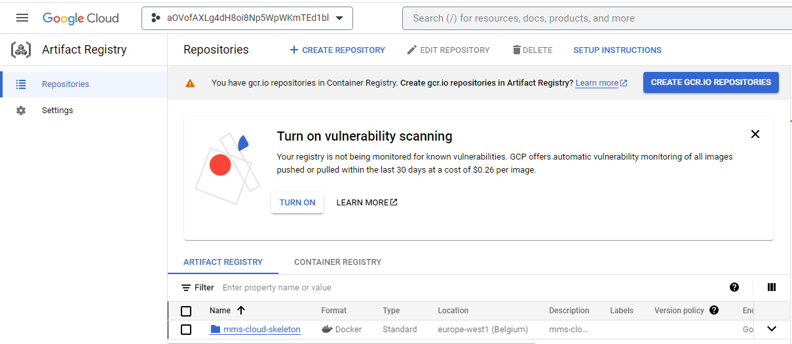

# MediaMarkt Cloud Engineering challenge

## Summary

This document resolves the _TASKS-OBJECTIVES_ and explains how to deploy the _mms-cloud-skeleton_ app in a _Google Cloud Platform_ project in a _Google Kubernetes Engine_.

## Pre-requisites

For deploying all, you need the following:

- [Install the gcloud CLI](https://cloud.google.com/sdk/docs/install)
- [Install terraform](https://developer.hashicorp.com/terraform/tutorials/gcp-get-started/install-cli)

## Tasks-objectives

### Cloud Build/Artifact to generate the container

For pushing the Cloud Build/Artifact to generate the container, please execute the following lines (tested on Ubuntu 20.04) on the root directory. Please change the value of _project\_id_ and _location_ with yours

``` bash
location=europe-west1
project_id=aovofaxlg4dh8oi8np5wpwkmted1bl

gcloud artifacts repositories create mms-cloud-skeleton--repository-format=docker --location=$location --description="mms-cloud-skeleton"

gcloud builds submit --region=$location --tag $location-docker.pkg.dev/$project_id/mms-cloud-skeleton/mms-cloud-skeleton-image:latest
```

Once the _gcloud builds submit_ is finished we can check it with the following command:

``` bash
gcloud artifacts repositories list

                            ARTIFACT_REGISTRY
REPOSITORY          FORMAT  MODE                 DESCRIPTION         LOCATION      LABELS  ENCRYPTION          CREATE_TIME          UPDATE_TIME          SIZE (MB)
mms-cloud-skeleton  DOCKER  STANDARD_REPOSITORY  mms-cloud-skeleton  europe-west1          Google-managed key  2023-03-27T18:37:29  2023-03-27T18:42:59  444.649
```

Or in the _GCP_ console in _Artifact Registry_ menu:



### Generation of the Docker Composer YAML

The Docker Compose YAML is stored in the root of the repository with the name [compose.yaml](..\compose.yaml) and is the following:

``` yaml
services:
  mms-cloud-skeleton:
    image: "europe-west1-docker.pkg.dev/aovofaxlg4dh8oi8np5wpwkmted1bl/mms-cloud-skeleton/mms-cloud-skeleton-image"
    ports:
      - "3000:3000"
```

This file is only for local deployment because _GKE_ can't use _Docker-compose_ files.

### Creation of the Terraform Files

In the folder [terraform](https://github.com/asensionacher/mms-cloud-skeleton/blob/main/terraform) are stored all the files for deploying the resources and the kubectl deployment to _GCP_. Please update the [terraform.tfvars](https://github.com/asensionacher/mms-cloud-skeleton/blob/main/terraform/terraform.tfvars) file with your values. The provided file is working fine for my environment.

This terraform deploys a private _GKE_ cluster with the resources needed for having connection to internet and also makes a _kubectl apply_ from a terraform module. 

### Commands for the Deployment through TF files (kubectl) 

#### First steps

First you have to prepare your environment and create the bucket for tfstates and the artifact registry. This step must be executed for manual and CI deployment.

``` bash
# Environment variable for bucket name
project_id=aovofaxlg4dh8oi8np5wpwkmted1bl

# Log in GCP
gcloud auth login 

# Create environment variable needed for executing from Terraform
export GOOGLE_OAUTH_ACCESS_TOKEN=$(gcloud auth print-access-token)

# Enable required services on GCP
gcloud services enable serviceusage.googleapis.com
gcloud services enable compute.googleapis.com
gcloud services enable container.googleapis.com
gcloud services enable cloudresourcemanager.googleapis.com
gcloud services enable cloudbuild.googleapis.com
gcloud services enable artifactregistry.googleapis.com

# Create storage bucket on GCP for storing TFStates
bucket_name="mms-cloud-skeleton-$project_id-tfstate"
gcloud storage buckets create gs://$bucket_name

```

##### Manual deployment

For manual deployment, the Terraform must be executed for the first time. This would create all the resources, including the _Cloud build_ and its trigger for be prepared for CI.

``` bash
bucket_name="mms-cloud-skeleton-$project_id-tfstate"
project_id=aovofaxlg4dh8oi8np5wpwkmted1bl
CLOUDBUILD_SA="$(gcloud projects describe $project_id \
    --format 'value(projectNumber)')@cloudbuild.gserviceaccount.com"
terraform init -backend-config="bucket=$bucket_name"
terraform plan -var="project_id=$project_id" -var="service_account_email=$CLOUDBUILD_SA"
terraform apply -var="project_id=$project_id" -var="service_account_email=$CLOUDBUILD_SA"
```

This may take up to 20 minutes. Now, you have to execute the _kubectl_ command for deploying the image and the service to _GKE_. 

``` bash
# Environment variables
location=europe-west1
project_id=aovofaxlg4dh8oi8np5wpwkmted1bl
cluster_name=mms-cluster-gke
docker_image=$location-docker.pkg.dev/$project_id/mms-cloud-skeleton/mms-cloud-skeleton-image

# Get credentials from the GKE for executing kubectl
gcloud container clusters get-credentials $cluster_name --region $location --project $project_id

# Deploy the yaml to the GKE
cat ../kubernetes/deployment.yaml | sed "s|{{DOCKER_IMAGE}}|$docker_image|g" | kubectl apply -f

# Get the public IP of the service deployed. It can take some time until EXTERNAL-IP appears
kubectl get service mms-cloud-skeleton-srv 
```

Now, if you open a browser to the IP that appears on _EXTERNAL-IP_ the webpage of _mms-cloud-skeleton_ should appear and you are ready for CI.

#### Cloud Build for CI/CD

The CI integration is going to be done with [GCP Cloud Build](https://cloud.google.com/build?hl=es). In order to have everything up for the deployment, we have to give editor role to the Cloud Build service account:

``` bash
CLOUDBUILD_SA="$(gcloud projects describe $PROJECT_ID \
    --format 'value(projectNumber)')@cloudbuild.gserviceaccount.com"
gcloud projects add-iam-policy-binding $PROJECT_ID \
    --member serviceAccount:$CLOUDBUILD_SA --role roles/editor
```

Then, go to the GCP console and create a _Cloud Build Project_ and a trigger from your repository. This step is not done by Terraform because we are also deploying the resources from there with Terraform. Once the _Cloud Build_ is created, make a push to your repository and all the environment is going to be created and also the _Kubernetes_ yaml will be pushed to _GKE_.

#### Remove all resources

You can remove all the resources executing the following command:

``` bash
terraform destroy
```

### Solution of the IAM Role assignation