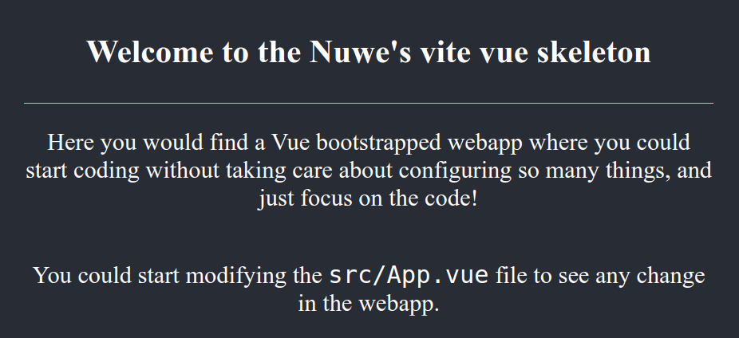
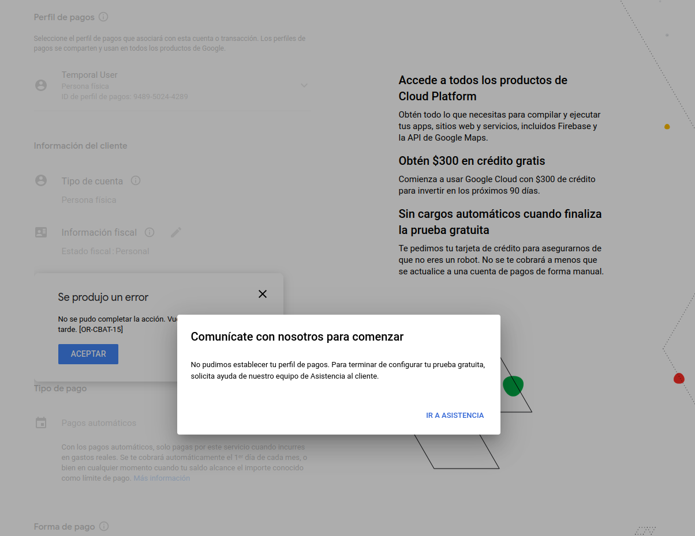
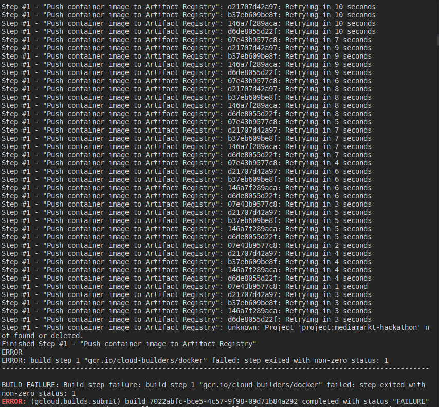

# MediaMarkt Hackathon - Challenge Solution

Indice:
- [MediaMarkt Hackathon - Challenge Solution](#mediamarkt-hackathon---challenge-solution)
  - [Requisitos](#requisitos)
  - [Registrar el Contenedor generado por el DockerFile con Cloud Build / Artifacts](#registrar-el-contenedor-generado-por-el-dockerfile-con-cloud-build--artifacts)
  - [Generar un fichero YAML para Docker Compose](#generar-un-fichero-yaml-para-docker-compose)
  - [Generar los ficheros Terraform para tener la infraestructura como código y poder desplegar con Kubernetes](#generar-los-ficheros-terraform-para-tener-la-infraestructura-como-código-y-poder-desplegar-con-kubernetes)
  - [Extra: Desplegar con Terraform los recursos Kubernetes definidos en un fichero yaml](#extra-desplegar-con-terraform-los-recursos-kubernetes-definidos-en-un-fichero-yaml)
  - [Pregunta sobre IAM](#pregunta-sobre-iam)
    - [Respuesta:](#respuesta)


## Requisitos

Para realizar esta práctica he necesitado las siguiente hereramientas:
- docker
- gcloud CLI
- terraform
- vscode
  
Ya tenía instalada la mayoría de estas excepto gcloud CLI. Para instalarla he seguido los siguientes pasos:
1. He descargado el instalador de gcloud CLI desde la [página oficial](https://cloud.google.com/sdk/docs/install).
2. He ejecutado el instalador en bash y he seleccionado la opción de instalar la CLI de gcloud.
3. He ejecutado el comando gcloud init para iniciar sesión en mi cuenta de Google Cloud.
4. He seleccionado el proyecto para esta práctica.


## Registrar el Contenedor generado por el DockerFile con Cloud Build / Artifacts
1. Primero, He realizado un análisis del [repositorio con la aplicación](https://github.com/nuwe-io/mms-cloud-skeleton/tree/main). 
2. Me he asegurado de que el Dockerfile construido funciona desplegando en local con los siguiente comandos:
   docker build -t foo .
   docker run -it -p 3000:3000 foo
   

   
3. Luego, he creado un archivo de configuración de Cloud Build ([cloudbuild.yaml](./cloudbuild.yaml)) que especifica las acciones que deben realizarse para compilar y registrar el contenedor en el Registry.
4. He ejecutado el comando `gcloud builds submit --config cloudbuild.yaml` para enviar la compilación a Cloud Build.

Aquí tuve una incidencia ya que google no me permitía habilitar el servicio de Cloud Build. Parecía un problema con la facturación de la cuenta. 



Con este problema he perdido alrededor de 1 hora y no he tenido resultados positivos. Así que no he podido continuar con este punto.



Lo único que quedaba es comprobar la compilación y el registro en la consola de google.


## Generar un fichero YAML para Docker Compose
1. He creado el fichero [docker-compose.yaml](./docker-compose.yaml).
2. He comprobado su despliegue en local.


## Generar los ficheros Terraform para tener la infraestructura como código y poder desplegar con Kubernetes
1. He creado los siguientes ficheros Terraform:

├── [deploy.tf](./terraform-gke/deploy.tf)
├── [main.tf](./terraform-gke/main.tf)
├── [service.tf](./terraform-gke/service.tf)
└── [variables.tf](./terraform-gke/variables.tf)

2. Una vez creados los ficheros, he ejecutado el comando `terraform init` para inicializar el directorio de trabajo.
3. Para comprobar el aprovisionamiento de la infraestructura, he ejecutado el comando `terraform plan` y he obtenido el siguiente resultado:

[](https://asciinema.org/a/2kTYPpujUkdKngNfNxoAPeoTX)

Lo suyo hubiese sido poder aplicar con el comando `terraform apply` pero no he podido por el problema con Cloud Build.

## Extra: Desplegar con Terraform los recursos Kubernetes definidos en un fichero yaml

Para aplicar desde Terraform los recursos Kubernetes definidos un fichero yaml, por ejemplo `deployment.yaml`, es necesario utilizar el recurso `null_resource` en Terraform y ejecutar el comando `kubectl apply`. Ejemplo:

```terraform
resource "null_resource" "apply_deployments" {
  provisioner "local-exec" {
    command = "kubectl apply -f ${path.module}/deployments.yaml"
  }
}

```

## Pregunta sobre IAM

*"MediaMarkt quiere almacenar información sensible en Google Cloud Platform (GCP) y utiliza el principio de mínimo privilegio en la asignación de roles. Supongamos que eres el encargado de asignar roles en GCP, admin de la organización. Tu tarea es decidir qué rol sería el adecuado para cada grupo de personas: el equipo de DevOps para la creación de clusters en Kubernetes y el equipo de Finanzas en la gestión de la facturación en GCP. Detalla qué roles deben aplicar y los pasos que aplicaron en la Consola IAM GCP."*

### Respuesta:

En este caso, se puede asignar el siguiente rol a cada equipo:

- **Equipo de DevOps**: para la creación de clusters en Kubernetes, se puede asignar el rol Kubernetes Engine Developer o Kubernetes Engine Admin. Estos roles permiten la creación y gestión de clústeres de Kubernetes, pero no proporcionan acceso a otros servicios de GCP.

- **Equipo de Finanzas**: para la gestión de la facturación en GCP, se puede asignar el rol Billing Account Administrator o Billing Account Viewer. Estos roles permiten la gestión de la facturación y el uso de los recursos de GCP asociados a la cuenta de facturación, pero no proporcionan acceso a otros servicios de GCP.
